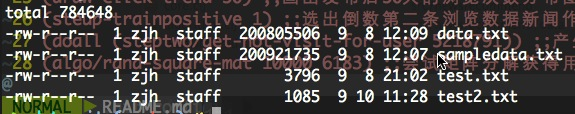

## psql

```sql
select * from news where post_timestamp > '2014-03-08 12:00:00';
```
```
select * from news where post_timestamp between '2014-03-08 12:00:00' and '2014-03-08 15:00:00';
```
psql的timestamp类型可以直接使用geq leq操作符重载

## data

原始数据中还是有噪声，数据日期有`year-month-day`和`year-month-day hour:minute`，以及会出现日期为NULL的情况

因为原始数据太大，所以没有一起push，要正常运行需要将原始数据放到`data/`路径下，并且命名成`data.txt`，为了保险起见，最好将原始数据用编辑器打开复制一份(_使用的是sublime_)，不然会出现编码问题(_应该是官方没有用utf-8编辑保存或者是bom头问题_)，`data/`路径如下所示，`sampledata.txt`为原始数据，`data.txt`为使用编辑打开复制一份得到的样本数据



## progress

```clojure
(setup-posttime) ;;因为会出现发布时间为NULL的情况以及有些记录中浏览时间会比发布时间早，所以需要为出现这些情况的新闻用最早出现的浏览时间作为发布时间
(setup-data) ;;将disk上的数据导入到psql中
(preprocess/fix-visit-older-than-post) ;;利用第一步中得到的发布时间来修改第二步中导入的记录，这一步只是修复原本样本数据中浏览时间早于发布时间的记录
(setup-interval) ;;将各条记录中的发布时间和浏览时间的时间间隔转化为以天为单位
(draw-click-trend 50) ;;画出发布后50天的浏览次数分布图
(steup-trainpositive 1) ;;选出倒数第二条浏览数据新闻作为训练正例
(doall (steptwo/get-not-visit-for-user 5218791)) ;;产生训练负例的尝试，但是负例太多，改用hadoop
(algo/rand-square-mat 10000 6183) ;;尝试矩阵分解获得用户对新闻评分，但是单机内存无法存储大矩阵，尝试spark mllib
(println (algo/big-vector-mul (algo/big-vector 10000) (algo/big-vector 10000))) ;;尝试了大向量的相乘，可行，后面可以用隐语义来试试
(setup-news-cities) ;;获得不同新闻内容中包含的城市名称
```

## dev

貌似文件名字中不能有`-`，不然`cider-namespace-reload`的时候就悲剧了，会找不到class文件
