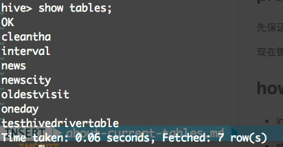

## now we have these datas

just ignore the `cleantha` and `testhivedrivertable` and tables

just check this out [sqls](https://github.com/zjhlocl/news-pre/blob/master/src/newsrecommend/dbutil/news.sql)

* interval 用户浏览新闻的时间间隔，用来统计各个时间间隔浏览新闻的衰减曲线
* news 存储用户新闻对
* newscity 存储新闻内容中存在的城市名信息 关于城市的编号 check this out [cities](https://github.com/zjhlocl/news-pre/blob/master/src/newsrecommend/data/city.clj#L3)
* oldestvisit 某一些新闻因为会出现数据噪声导致其发布时间为NULL，或者会出现浏览时间早于发布时间的情况，所以要获得某一条新闻最早的浏览时间来近似代替其发布时间
* oneday 统计浏览时间和发布时间间隔在一天以上的用户新闻对

## TODO

* 训练正例(_之前有，但是还是用mr再来一次啥的吧_)
* 训练负例
* svd
