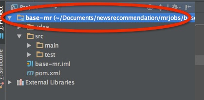
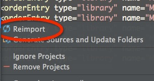
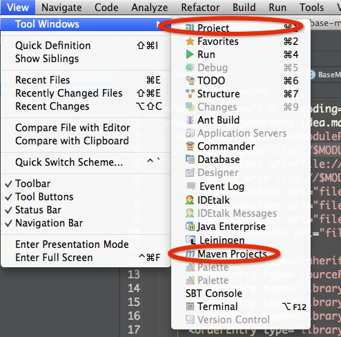
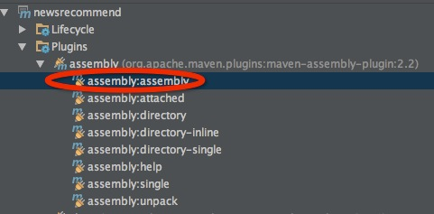

## prepare

先保证可以访问这个FTP页面[cleantha repo](http://10.214.161.163:8081/nexus/content/repositories/cleantha/)

现在镜像源搭在163上，应该可以访问到

## how to use this template

* intellij idea 13.1 ultimate is highly recommended

* step0

将base-mr工程以maven形式导入idea

* step1

右键工程路径，然后点击`maven`选项

* step2

点击第一步弹出的菜单，单机红圈标出的`Reimport`来solve dependencies

* step3

点击view菜单，打开maven侧边栏

* step4

点击maven plugins中的assembly来编译工程生成jar包，有问题可以使用clean选项

* step5

just coding with mr, have fun
