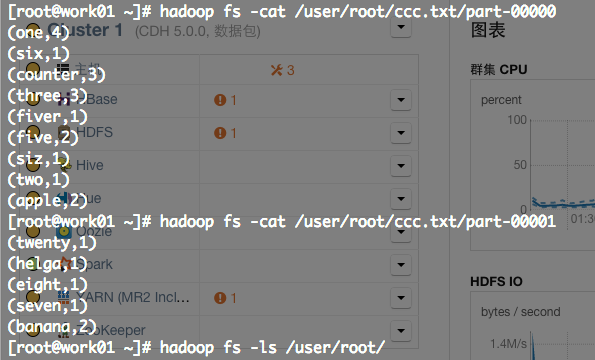
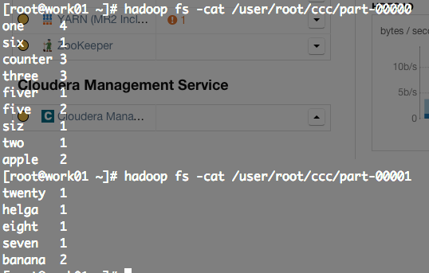
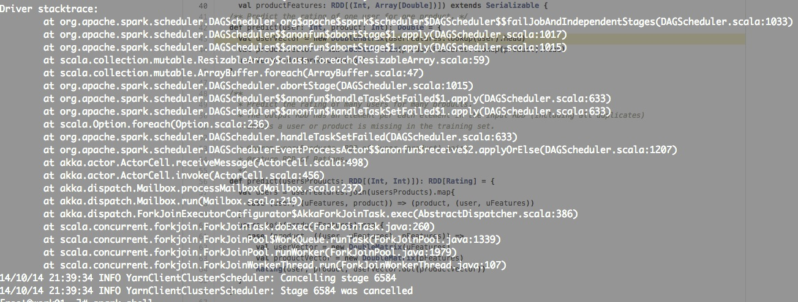

mllib是神器，好好折腾 :)

## spark output to hdfs

checkout this piece of code [format1](https://github.com/zjhlocl/news-spark/blob/master/cleantha.scala#L3)

checkout this piece of code [format2](https://github.com/zjhlocl/news-spark/blob/master/cleantha.scala#L4)

## why should use spark

#### 一个例子是生成训练正例，训练正例需要每一个用户最近浏览记录的前一条记录，也就是要得到用户所有浏览记录中浏览时间和新闻发布时间间隔第二长的那一条记录

* use hive

you can see the jdbc code here [jdbc-hive](https://github.com/zjhlocl/news-hive/blob/master/src/GetTrainPositive.java#L47)

hive really works but the point is that hive is really slow to do this kind of job(_其实也是因为集群的机器配置不高，不过hive的性能一直被诟病_)

* use mapreduce

you can see the mr code here [mr](https://github.com/zjhlocl/news-mr/blob/master/base-mr/src/main/java/GetTrainPositiveRunner.java#L26)

运行的时候出现了indexoutofbound exception，我觉得原因就是出在Combiner的时候也要自己重新写过，而且要实现这个功能必然要写链式的mr，或者存一次文件再来一次mr，异常的繁琐

* use spark

一个还没写完的原型，但是it's really concise and elegant

you can checkout this piece of code [here](https://github.com/zjhlocl/news-spark/blob/master/cleantha.scala#L35)

4行代码就获得了我要的目标日期，当然这个计算量还是有的，也不是一下子跑出来的，但是比hive快多了，而且哪一个mapreduce程序是只有4行的!!!!!

## start to work

集群目前升级至spark1.0.0，支持spark-submit

后面使用的idea项目为[news-spark](https://github.com/zjhlocl/news-spark/tree/master/news-spark)，查看readme，上面有如何打包以及执行jar文件的方法

## matrix decomposition

[matrix decomposition](https://github.com/zjhlocl/news-spark/blob/master/svd.scala)，spark-shell中执行了svd，spark1.1.0的mllib较1.0.0改动了很多，功能强大了许多，就`Matrics`这一个类的源码来说
* [1.0.0 source code](https://github.com/apache/spark/blob/branch-1.0/mllib/src/main/scala/org/apache/spark/mllib/linalg/Matrices.scala)
* [1.1.0 source code](https://github.com/apache/spark/blob/master/mllib/src/main/scala/org/apache/spark/mllib/linalg/Matrices.scala)

但是集群上目前升级至1.1.0有一些困难，so...，只能是参考1.1.0的源码来实现一些功能，

* [ones](https://github.com/zjhlocl/news-spark/blob/master/svd.scala#L15) => 生成全部为1的矩阵
* [zeros](https://github.com/zjhlocl/news-spark/blob/master/svd.scala#L12) => 生成全部为0的矩阵
* [eye](https://github.com/zjhlocl/news-spark/blob/master/svd.scala#L23) => 生成单位矩阵
* [diag](https://github.com/zjhlocl/news-spark/blob/master/svd.scala#L40) => 生成任意的对角矩阵

spark的其他例子 => [examples](https://github.com/apache/spark/tree/master/examples/src/main/scala/org/apache/spark/examples)

## 对RDD的一些理解

rdd在没有action之前都似乎散布在各个node之上的lazy的逻辑数据，做各种transform都是一样，分布式的进行处理，只有在action之后，才会最终由某几个节点来realize出来数据

## parallelize slices

>One important parameter for parallel collections is the number of slices to cut the dataset into. Spark will run one task for each slice of the cluster. Typically you want 2-4 slices for each CPU in your cluster. Normally, Spark tries to set the number of slices automatically based on your cluster. However, you can also set it manually by passing it as a second parameter to parallelize (e.g. sc.parallelize(data, 10)).

* [preference](http://spark.apache.org/docs/latest/programming-guide.html)
* [sourcecode](https://github.com/apache/spark/blob/master/core/src/main/scala/org/apache/spark/SparkContext.scala#L453)

关于数据分片的底层机制还是没有很清楚，所以现在暂时还是让spark在自动做这件事情

## groupby & groupbykey

`groupByKey([numTasks])` => 传入的参数是reducer的个数也就是partition的个数

* [preference](http://spark.apache.org/docs/latest/programming-guide.html)
* [examples](http://homepage.cs.latrobe.edu.au/zhe/ZhenHeSparkRDDAPIExamples.html)
* [how i use groupby](https://github.com/zjhlocl/news-spark/blob/master/news-spark/src/main/scala/org/give/newsspark/GenerateUserFeature.scala#L56)

## bug fix

需要使用recommendation里面的一些东西的话，在debian和redhat系里面的一些发行版中需要装上fortran的一个数值库

* or debian/ubuntu use:  `sudo apt-get install libgfortran3`
* for centos use:  `sudo yum install gcc-gfortran`

[reference](http://stackoverflow.com/questions/24758314/apache-spark-mllib-collaborative-filtering)

## common bugs

有时候如果用spark-shell没有问题，使用spark-submit就出现这个诡异的问题了，跑着跑着自己挂掉了出DAG的exception，比如这两个spark app

* [explicitfeedbackwithbestmodel](https://github.com/zjhlocl/news-spark/blob/master/news-spark/src/main/scala/org/give/newsspark/cfyarn/ExplicitWithBestModel.scala)
* [implicitfeedbackwithbestmodel](https://github.com/zjhlocl/news-spark/blob/master/news-spark/src/main/scala/org/give/newsspark/cfyarn/ImplicitWithBestModel.scala)

* [也是遇到的一个问题，提到了用笛卡尔积](http://stackoverflow.com/questions/24652518/scala-matcherror-null-on-spark-rdds)

